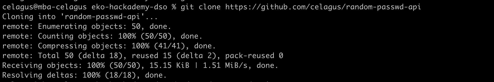
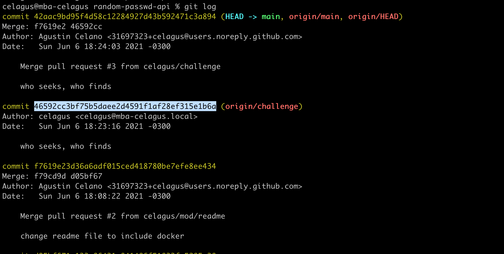
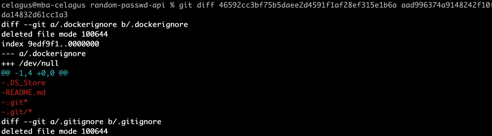

# Ejercicio 2: Git History

## Intro
Bienvenidxs! Este es el segundo ejercicio del módulo de DevSecOps de Ekoparty Hackademy. En el ejercicio anterior aprendieron a usar Git de forma básica para colaborar en proyectos. En esta oportunidad aprenderemos a navegar dentro del historial de versiones de un repo y detectar una vulnerabilidad típica de muchos desarrolladores.

## Requisitos
* Instalar git en tu entorno local - [instructivo](https://git-scm.com/book/es/v2/Inicio---Sobre-el-Control-de-Versiones-Instalaci%C3%B3n-de-Git)
* Tener una cuenta en GitHub - [Sign Up](https://github.com/join)

## Objetivos del aprendizaje
1. Aprender a usar los comandos log y checkout para navegar entre versiones
2. Detectar un leak de credenciales escondido en alguna de las versiones

## Manos a la obra!
1. Clona el repositorio "celagus/random-passwd-api" con el comando `git clone https://github.com/celagus/random-passwd-api`.

2. Ingresa al repositorio (`cd random-passwd-api` o el comando equivalente en tu SO).
3. Con el comando `git log` lista las versiones anteriores del repo

4. Para pararte en cualquier versión del repo usa el comando `git checkout HASH`, donde "HASH" debe ser reemplazado por el equivalente al hash del commit (cada vez que se commitea un cambio se genera un nuevo hash).

5. Puedes usar `git diff HASH1 HASH2` para encontrar las diferencias que ocurrieron entre dos commits diferentes

6. En una de las versiones hay un file con variables de entorno que hacen referencia a credenciales de BBDD (lo encontraste? 👀). Cuidado, este  es un típico error que cometen los desarrolladores y que puede terminar en un compromiso! En caso de que te suceda la mejor práctica es rotar las credenciales en cuestión, pero también puedes seguir [este procedimiento](https://docs.github.com/en/github/authenticating-to-github/keeping-your-account-and-data-secure/removing-sensitive-data-from-a-repository).
